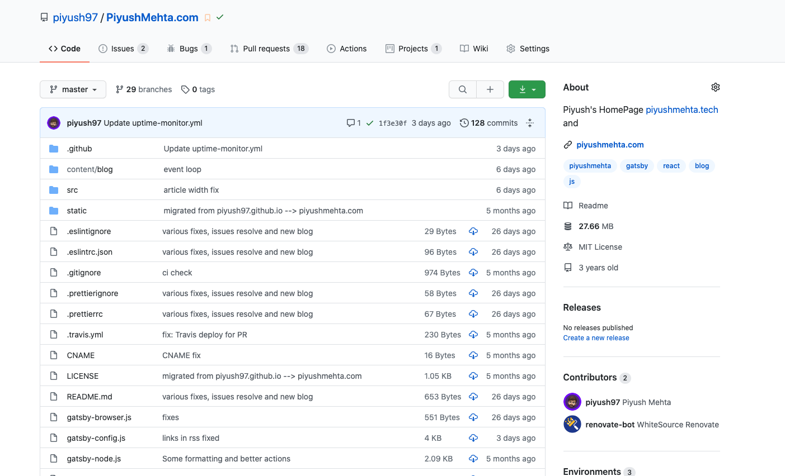
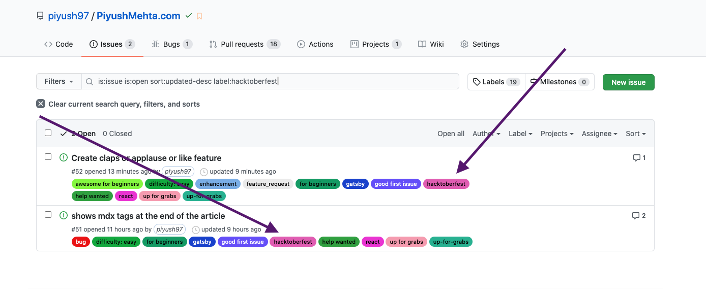

Hacktoberfest 2020 is a month long virtual festival event to celebrate open source contributions presented by Digital Ocean, Intel and DEV. It is the easiest way to get into open source!

## Do you know what is Open Source?


- Open-source software is software that is freely available to use, redistribute,
  and modify. Projects that are open source encourage a transparent process that is
  advanced through distributed peer review. Open-source projects can be updated quickly
  and as needed, and offer reliable and flexible software that is not built on locked
  proprietary systems.

* The best way to begin to contribute to open-source projects is to start by contributing
  to software that you already use. As a user of a particular tool, you best understand
  what functionalities would be most valuable to the project. Make sure you read any
  available documentation about the software first. In fact, many open-source projects
  will have a CONTRIBUTING.md file in the root directory, which you should read carefully
  before you contribute. You may also want to get a sense of the interactions between
  other developers in the community if there are forums about the project available.


Finally, if you’re just starting out with contributing to open-source software,
it is a good idea to start with something small — each contribution is valuable.
You may want to start with fixing typos, adding comments, or writing clearer documentation.

## Lets check if you have Git Installed

You can check whether Git is installed and what version you are using by opening up a terminal window in Linux or Mac, or a command prompt window in Windows, and typing the following command:

```bash
git version
```

However, if Git is not installed, you will receive an error similar to the following:

```bash
-bash: git: command not found
```

````bash
'git' is not recognized as an internal or external command, operable program or batch file.```
````

In this case, you should install Git into your machine first <a href="https://git-scm.com/book/en/v2/Getting-Started-Installing-Git"> Install Git Guide </a>

<h4>
  <a
    href="https://pdfhost.io/v/mlgllQUwu_Git_Cheatsheet_Single_Page_1pdf.pdf"
    target="_blank"
  >
    Git CheetSheet
  </a>
</h4>

## How to contribute to Open Source ❓


# Steps to follow 📜

## Step 1:

<li>
  {' '}
  Register for Hacktoberfest You can register from <a
    href="https://hacktoberfest.digitalocean.com/"
    target="_blank"
  >
    here.
  </a>
</li>

## Step 2:

- Go to the repository where you want to contribute to!
- Example: <a href="https://github.com/piyush97/piyushmehta.com" target="_blank">This Repository</a>
  

## Step 3: 🐛

- Go to the issues tab
- Find the issue with a label of hacktoberfest (Tip: You can even filter it)
  

## Step 4: 🍴

- Read the title and description to know what the author really wants?
- want to work on that issue?
- Fork It! (You can get your own fork/copy of the project by using the Fork button)

  

## Step 5: 🐢 🐇


- Ready, Steady, Go...
- Make the required changes/feature

## Step 6: ⭐

- Create a Pull Request (PR) [Learn More](https://docs.github.com/en/free-pro-team@latest/github/collaborating-with-issues-and-pull-requests/creating-a-pull-request)
- Star the Project! 🌟
- Wait for the author's comments

<center>
  <h3> Make 4 valid PRs</h3>
</center>

# And Wait for GitHub to mail you the form for shipping of Schwags 👕


Fin!
