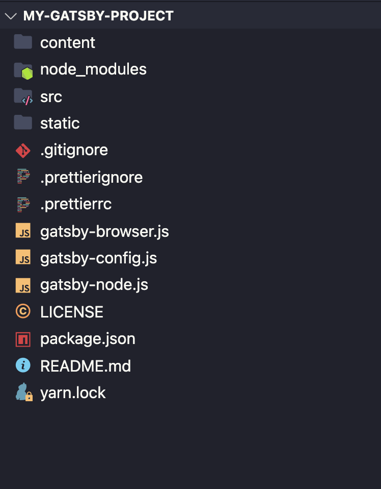
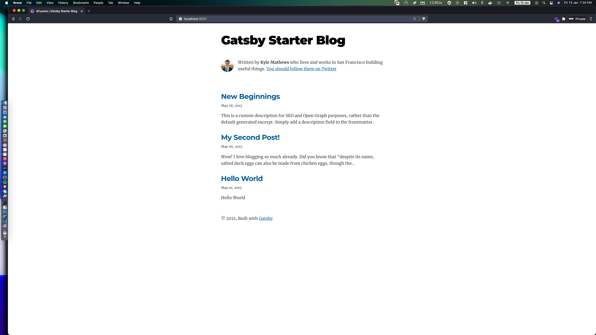
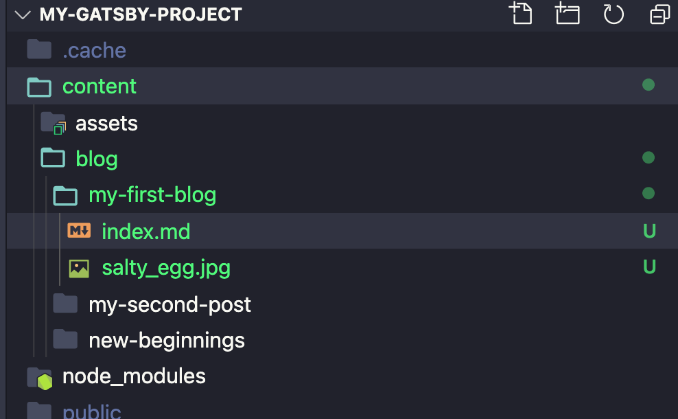

### Step 1
- So first of all, make sure you have Nodejs and VSCode installed on your pc. 

- If not, download it from __VSCode__ from here https://code.visualstudio.com/download and __NodeJs__ from here: https://nodejs.org/en/

# Step 

- Open your terminal and write down: 
```bash
npm install -g gatsby-cli
```

```bash
# This is the starter which we will use
gatsby new my-gatsby-project https://github.com/gatsbyjs/gatsby-starter-blog
```

```bash
  cd my-gatsby-project
```

# Step 3

- Open the project in Vscode
```bash
code . 
```

- The Project structure should look like this:



- Gatsby will start a hot-reloading development environment accessible by default at `http://localhost:8000`.
Website should look like this


# Step 4 
### Write your own blog


- Change the name of the folder `hello-world` to the title of your blog in our case `my-first-blog`
- Write your content in index.md using Markdown
- You can learn about basic markdown from here: https://www.markdownguide.org/basic-syntax

### And you're done!

# Step 5
### Host it for free; Press this button to deploy!

[](https://vercel.com/new/git/external?repository-url=https%3A%2F%2Fgithub.com%2Fvercel%2Fnext.js%2Ftree%2Fcanary%2Fexamples%2Fhello-world)

<div style="width:100%;height:0;padding-bottom:83%;position:relative;"><iframe src="https://giphy.com/embed/NKA63NRZZQ52Nvjzvs" width="100%" height="100%" style="position:absolute" frameBorder="0" class="giphy-embed" allowFullScreen></iframe></div>

