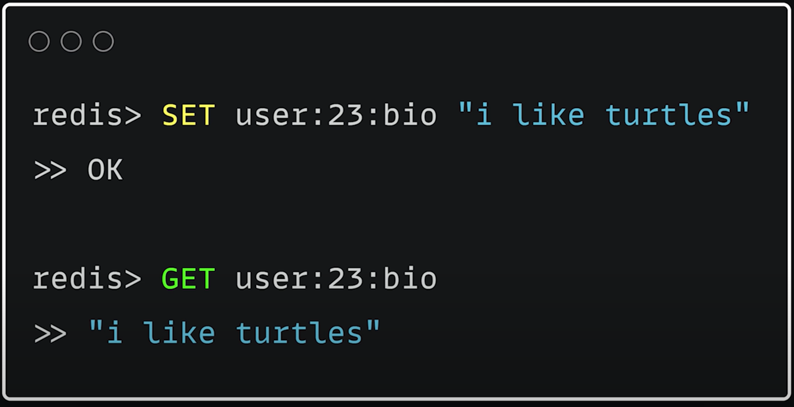
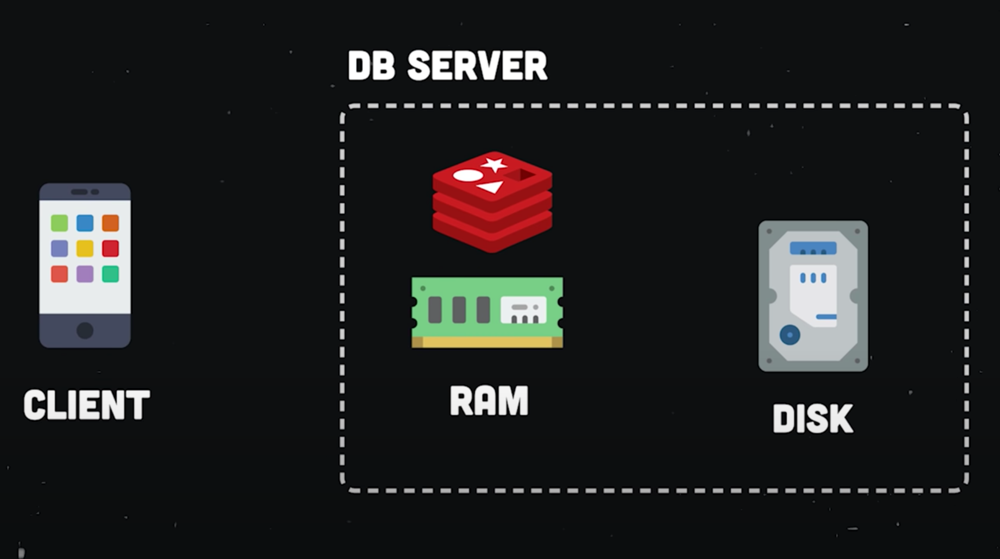
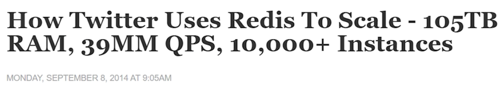
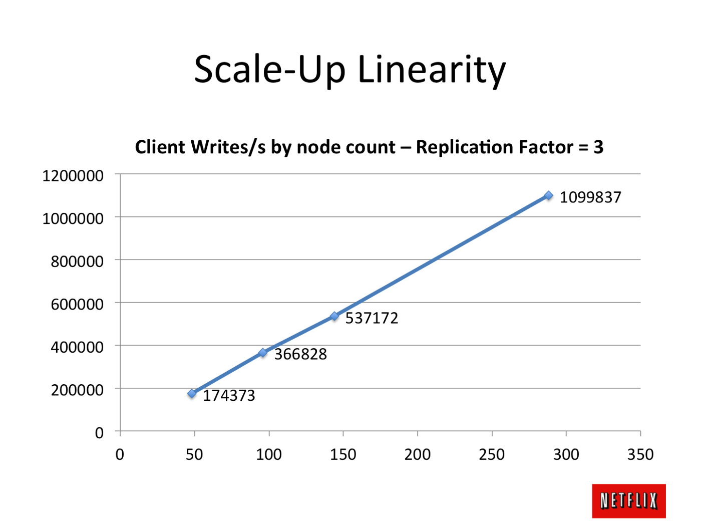
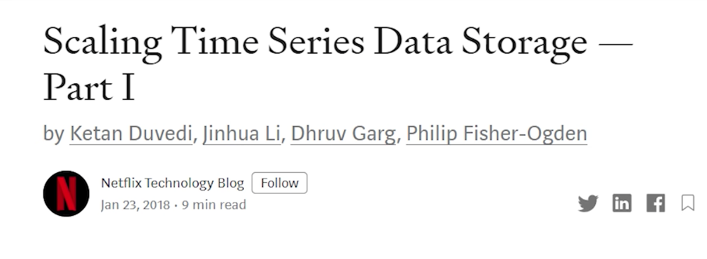

> Use the right tool for the job

When it comes to App/Software development, choosing the right database is the most important decision one can take.

## We will learn which Db to use when?

> Don't bring a knife to a gunfight

### The most simple type

## 1. Key Value Database

* A key–value database, or key–value store, is a data storage paradigm designed for storing, retrieving, and managing associative arrays, and a data structure more commonly known today as a `dictionary`, `hash table` or `JSON`. Dictionaries contain a collection of objects, or records, which in turn have many different fields within them, each containing data. These records are stored and retrieved using a key that uniquely identifies the record, and is used to find the data within the database.
* **Example**: Redis, Memcached
* **_Usages_**: Message Queues, Caching, Pub/Sub and gaming leaderboards

* SET sets the value for a particular key
* Get retrieves the value for a particular key

## This data is stored in memory as compared to all other databases where data is stored in disk.

* This makes the data read and write really fast!
* The amount of data which can be stored is limited
* No Queries, no joins!


#### Real Life uses:


### The database which supports only key value pair is very limited and hence we moved to a new category

## 2. Wide Column

* It's a Key value pair database, but the value is `2 Dimensional`, the value part can be multiple columns. A wide-column store (or extensible record stores) is a type of NoSQL database. It uses tables, rows, and columns, but unlike a relational database, the names and format of the columns can vary from row to row in the same table. A wide-column store can be interpreted as a two-dimensional key–value store.
* **Example**: Cassandra, Hbase
* **_Usages_**: Time series, Historical records, High Write and Low Read Data

CQL Example: Cassandra Query Language

```sql
Insert into KeyspaceName.TableName(ColumnName1, ColumnName2, ColumnName3 . . . .)
values (Column1Value, Column2Value, Column3Value . . . .)
```

* Doesn't have a schema, can handle unstructured data
* No Joins!

## This data is stored in memory as compared to all other databases where data is stored in disk.

* This makes the data read and write really fast!
* The amount of data which can be stored is limited
* No Queries, no joins!
* It Scales


#### Real Life uses:


Fin!
