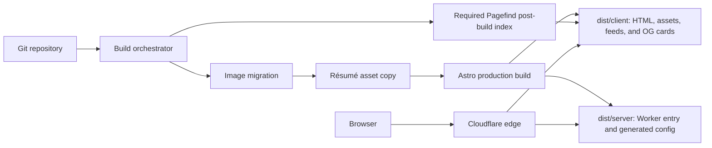
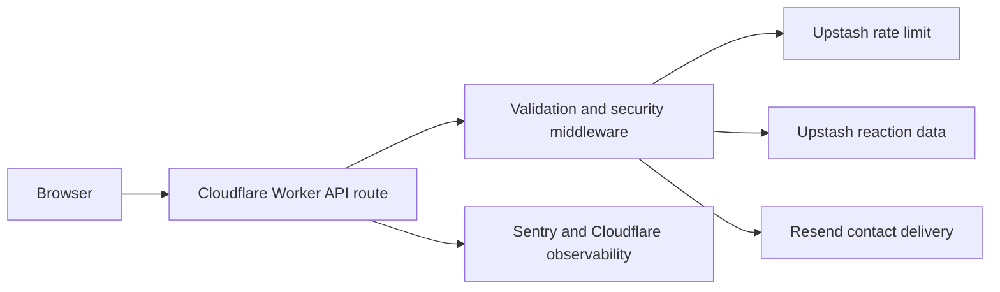
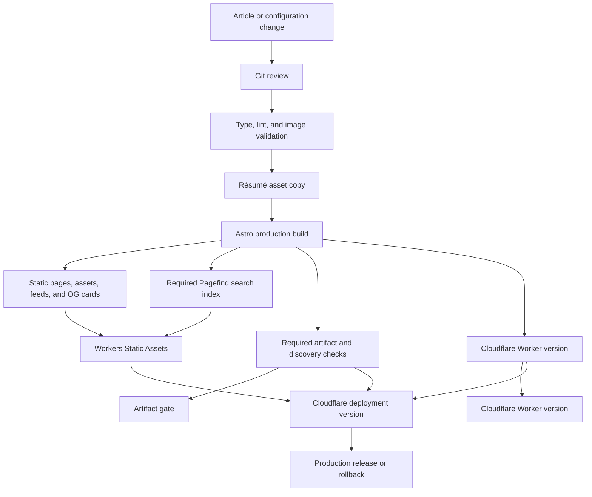
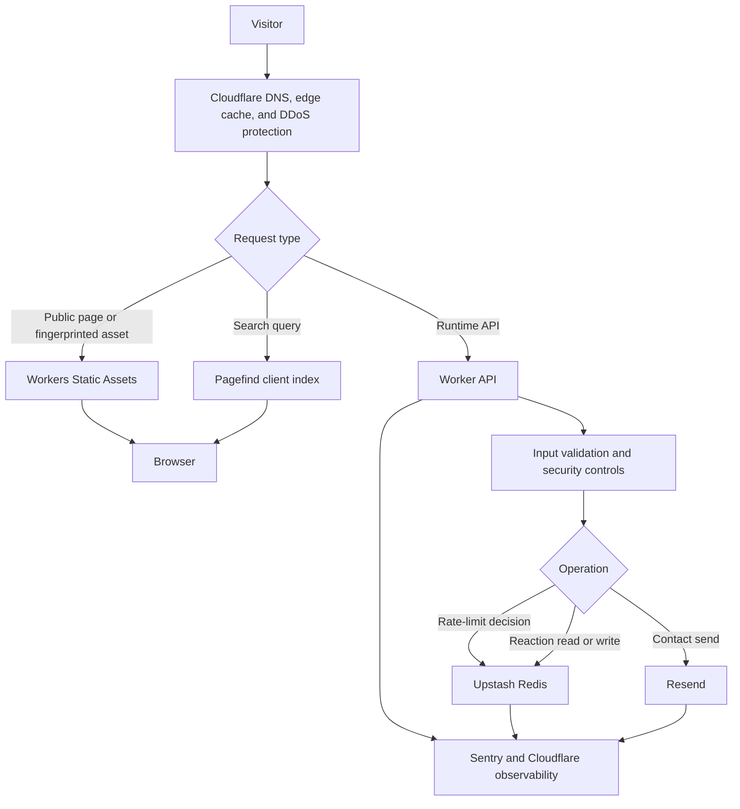
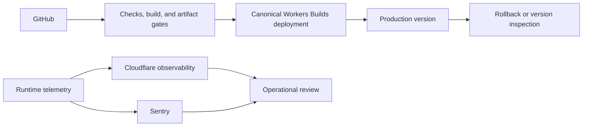

# System architecture

**Status:** Accepted design — source implementation complete; production verification pending
**Last reviewed:** 2026-09-24
**Primary goal:** Serve public content through viral traffic bursts without introducing a runtime database or origin fleet.

## 1. Executive decision

The accepted target is not a database-backed blog. It is a build-time content system with an edge-delivered static frontend and a small set of independently scalable runtime APIs. The current source still has the gaps recorded in Section 5; this document defines the implementation target rather than claiming those changes are already deployed.

- Git and MDX remain the source of truth for articles.
- Astro produces public pages, feeds, social cards, and search assets at build time; only API routes execute Worker code.
- Cloudflare Workers Static Assets serves public content from the edge.
- Workers execute only routes that require runtime behavior.
- Upstash Redis holds explicitly owned operational state, including rate limits and reaction counters.
- Resend owns contact delivery; no newsletter audience is retained.
- No application database is introduced until a named feature requires durable, queryable state.
- The target release uses the Astro-generated `dist/server/wrangler.json` as the canonical deployment configuration, with `dist/client/` as the public asset directory.
- The target release treats shipped generated artifacts as requirements; missing search, feed, OG, redirect, or discovery output fails the build.
- The target release disables Giscus comments until real identifiers and matching CSP origins are approved.
- The newsletter product surface is retired; readers are directed to the writing archive and RSS.
- The target reaction model is anonymous, eventually consistent counters bounded to published post slugs.

This is recorded in [ADR-0001](../adr/0001-keep-public-content-build-time.md) and [ADR-0002](../adr/0002-canonical-deployment-and-build-gates.md).

**Implementation status:** The source-side release/build and runtime hardening work is implemented and locally verified. The newsletter product surface has been retired; readers are directed to the writing archive and RSS instead. Remaining work is external production verification: confirm Cloudflare Workers Builds settings, inspect deployed cache/security headers, and validate provider-backed behavior with real secrets.

## 2. Goals

1. Absorb article launch traffic and viral referrals at the edge.
2. Keep public article availability independent of Redis, Resend, and runtime API health.
3. Publish content atomically through the existing build and deployment pipeline.
4. Keep operational state small, explicit, and disposable where possible.
5. Make provider failures visible and bounded rather than silently hiding them.
6. Leave a clear migration path to D1 or another database without prematurely building one.

## 3. Non-goals

The baseline does not include:

- A CMS or runtime article editor.
- User accounts, comments, or moderation workflows.
- A local copy of Resend subscriber records.
- Durable contact or lead management.
- Multi-region writes or region-specific content.
- A read replica, message broker, or cache cluster added without measured demand.
- Generic repository, service, or dependency-injection frameworks.

## 4. Workload assumptions

| Assumption                                                     | Consequence                                                                                                           |
| -------------------------------------------------------------- | --------------------------------------------------------------------------------------------------------------------- |
| Public page reads dominate traffic                             | Static assets and the CDN are the scaling path.                                                                       |
| Articles change through Git and a deployment                   | Build output is a versioned content snapshot.                                                                         |
| Traffic is bursty rather than steadily growing                 | Edge capacity matters more than application-server throughput.                                                        |
| Reaction and form traffic is much lower than page reads        | Runtime APIs remain small and can scale independently.                                                                |
| Reaction counts are anonymous and may be eventually consistent | Redis does not need to become a relational system of record.                                                          |
| Contact delivery is externally owned                           | Resend remains the delivery boundary; no newsletter audience is part of the product.                                  |
| No application-owned durable PII store is required             | There is no current reason for a local database; transient rate-limit and provider-processing boundaries still apply. |

These are design assumptions, not measured traffic claims. Baseline traffic and latency data should be collected before assigning capacity thresholds.

## 5. Current architecture

### 5.1 Build and delivery flow

Most public routes are prerendered even though Astro uses Cloudflare server output. This is intentional: server output is the application mode, while route prerendering determines which requests execute Worker code.

### 5.2 Runtime flow

The runtime dependency graph is intentionally narrow. A Redis or Resend outage can affect an API route, but it must not prevent an already-deployed article from being read.

### 5.3 Current boundaries

| Concern                         | Current owner                                            | Runtime dependency       |
| ------------------------------- | -------------------------------------------------------- | ------------------------ |
| Article content                 | Git and MDX                                              | None after deployment    |
| Portfolio content               | Typed source data                                        | None after deployment    |
| Blog listing and article routes | Astro build                                              | None after deployment    |
| Search                          | Required Pagefind static index                           | None after deployment    |
| Reactions                       | API route and Upstash Redis                              | Redis                    |
| Contact submission              | API route and Resend                                     | Resend; Redis for limits |
| Social-card rendering           | Prerendered Astro route using Satori and Resvg           | Build-time only          |
| Comments                        | Disabled; no comment provider is shipped                 | None                     |
| Monitoring                      | Sentry, Workers logs, traces, and optional Web Analytics | Monitoring providers     |
| Secrets                         | Worker secrets and environment bindings                  | Runtime configuration    |

The environment schema still contains legacy database, mail, and CMS variables. Those declarations are not evidence of an active dependency. They should be removed only after a callsite and deployment audit confirms that no current build or Worker path reads them.

### 5.4 Runtime route inventory

| Route            | Current behavior                                    | Current external dependency |
| ---------------- | --------------------------------------------------- | --------------------------- |
| `/api/reactions` | Public cached reads and rate-limited counter writes | Upstash Redis               |
| `/api/contact`   | Origin-checked, rate-limited email submission       | Upstash Redis and Resend    |

All other current public routes, including the parameterized OG route, are prerendered.

### 5.5 Pre-implementation findings and remaining verification risks

The items below are retained as the audit record that drove the implementation. Most source-side mitigations are now present; the progress table in Section 5.6 identifies the remaining external verification work.

1. **The deployment artifact boundary still needs external verification.** The package and README target the generated `dist/server/wrangler.json` and `dist/client`; confirm the Cloudflare Workers Builds dashboard uses the same commands and that no path uploads `dist/server` as public content.
2. **The release gate is now fail-closed locally.** Fresh output, Pagefind, OG/discovery checks, redirect validation, the résumé asset, and server/client boundaries are validated; verify the deployed artifact and rollback behavior in Cloudflare.
3. **Contact and reaction provider behavior needs production exercise.** Local tests cover bounded requests, `User-Agent`, `no-store`, published-slug allowlisting, and no-retry writes; real Resend/Upstash failure modes remain external verification.
4. **The configured memory cache is not part of the current scaling path.** No `Astro.cache` callsite was found, so its process-local cache is not described as a shared article cache.
5. **The current E2E job is disabled.** CI validates checks and a build, but does not exercise a deployed Worker or real provider integrations.
6. **Legacy Sanity variables remain in the environment schema for migration compatibility.** They have no active callsite and should be removed only after the deployment and migration audit is complete.
7. **Static cache headers need production comparison.** `public/_headers` covers the release policy, but clean-build checks cannot prove the deployed CDN response.

### 5.6 Implementation progress

| Area                        | Source status                                                                                                      | Remaining verification                                                               |
| --------------------------- | ------------------------------------------------------------------------------------------------------------------ | ------------------------------------------------------------------------------------ |
| Generated deployment config | Package, README, CI, and release validator use `dist/server/wrangler.json`                                         | Confirm Cloudflare Workers Builds dashboard commands and production version contents |
| Build outputs               | Fresh `dist/`, required Pagefind, release validator, and fail-closed migration                                     | Verify deployed assets and rollback in Cloudflare                                    |
| Contact boundaries          | Origin, body/field limits, timeouts, `User-Agent`, and `no-store` implemented                                      | Exercise real Resend/Upstash failures without exposing secrets                       |
| Reactions                   | Build-generated published-slug manifest, namespaced keys, no fake zeroes, no-retry write client, UI reconciliation | Verify Redis cardinality and provider behavior in production                         |
| Giscus                      | Removed from article routes                                                                                        | Re-enable only through a separate decision                                           |
| Privacy/setup docs          | Legacy providers marked inactive; privacy copy updated                                                             | Obtain legal/product review for final policy wording                                 |
| Static headers              | Explicit rules and clean-build validation added                                                                    | Compare production response headers with the source policy                           |

## 6. Target architecture

### 6.1 Build plane

The build plane changes slowly and produces an immutable deployment version.

A failed build does not replace the serving version. A successful deployment replaces the public content as one versioned snapshot. Search, generated social cards, feeds, and their discovery metadata are release capabilities, not optional side effects: if the site ships a page that depends on them, their generation and verification must be mandatory.

### 6.2 Request plane

### 6.3 Control plane

The control plane is kept separate from the visitor request path. A monitoring-provider outage must not block page delivery or API processing. Production deployment must use one documented Wrangler configuration and one static asset root; CI, preview, and rollback must exercise that same release contract.

## 7. Data ownership

| Data                         | Source of truth                                                           | Runtime store            | Consistency requirement             |
| ---------------------------- | ------------------------------------------------------------------------- | ------------------------ | ----------------------------------- |
| Article body and frontmatter | Git/MDX                                                                   | Static deployment output | Atomic per deployment               |
| Portfolio entries            | Typed source files                                                        | Static deployment output | Atomic per deployment               |
| Latest-article ordering      | Build-time content query                                                  | Static deployment output | Same snapshot as article pages      |
| Search documents             | Generated from published content                                          | Pagefind assets          | Same content release                |
| Rate-limit windows           | Upstash Redis                                                             | Upstash Redis            | Short-lived and operational         |
| Reaction totals              | Upstash Redis while this feature remains ephemeral                        | Upstash Redis            | Eventual is acceptable              |
| Contact delivery status      | Resend                                                                    | Resend                   | Provider-managed                    |
| Contact messages             | Resend delivery path                                                      | No local copy            | No application database requirement |
| Comments                     | Disabled in the baseline; Giscus remains an unapproved future integration | None                     | Not applicable                      |
| Secrets                      | Cloudflare deployment configuration                                       | Worker bindings          | Never public                        |
| Operational telemetry        | Sentry and Cloudflare                                                     | Monitoring systems       | Best effort, access controlled      |

Do not duplicate a value in Redis or a future database unless a documented feature reads that copy and defines how divergence is repaired.

### 7.1 Personal-data boundary

“No application database” does not mean “no personal data processing.” The target boundaries are:

- A client IP may be used transiently as part of a rate-limit key; its retention in Upstash must follow the provider's documented TTL and privacy settings.
- Cloudflare Workers logs and traces may persist request metadata; sampling, retention, access, and redaction must be reviewed before production.
- Sentry should receive safe structured tags, not raw IP addresses or message bodies.
- Resend receives the email address and, for contact submissions, the name, subject, message, and reply address; provider retention and deletion behavior must be documented.
- The application does not create a local durable lead or contact database in the baseline.

The privacy policy and telemetry configuration must describe these boundaries accurately; they must not imply that the site collects no IP or form data.

## 8. Caching strategy

Caching is a set of policies tied to data ownership, not one global TTL.

| Response                                 | Generation                            | Browser policy                                                   | Edge/application cache                                  | Invalidation                                  |
| ---------------------------------------- | ------------------------------------- | ---------------------------------------------------------------- | ------------------------------------------------------- | --------------------------------------------- |
| Fingerprinted JS, CSS, fonts, and images | Build                                 | Long-lived and immutable                                         | Automatic global static-asset cache                     | New asset URL on deploy                       |
| Home, blog index, and article HTML       | Build                                 | Revalidate with ETag; preserve deploy correctness                | Automatic global static-asset cache                     | Deployment version and ETag                   |
| Latest-article list                      | Included in prerendered HTML          | Same as containing page                                          | No Redis or database cache                              | Next deployment                               |
| RSS and sitemap                          | Build                                 | Current route policy, initially one hour                         | Edge caching where configured                           | TTL or next deployment                        |
| Pagefind index                           | Build, required when `/search/` ships | Static client asset                                              | Automatic global static-asset cache                     | New index on deploy                           |
| Reaction responses                       | Runtime, only for known post slugs    | Short public freshness with stale reads is acceptable            | Current target: `s-maxage=10` with bounded stale window | TTL; version URL is not required for counters |
| Contact `POST` responses                 | Runtime                               | `no-store`                                                       | Never cache                                             | Not applicable                                |
| Social cards                             | Build; currently prerendered          | One-year immutable is intended; emitted headers must be verified | Automatic global static-asset cache                     | Content-derived version URL                   |

RSS currently has overlapping `Cache-Control` declarations in Astro route rules and `public/_headers`; sitemap and robots rely on Astro rules. The target has one documented policy per emitted asset, verified from a clean build and from production response headers.

### 8.1 Latest articles

The latest-article list is generated during the Astro build from the content collection. A request-time database lookup would add a network hop and make article availability depend on data-store health without improving freshness, because content changes still require a deployment.

The correct optimization path is:

1. Keep the list in prerendered HTML.
2. Avoid shipping an additional latest-articles API request.
3. Ensure static asset delivery and ETag revalidation are correct.
4. Measure edge delivery and page performance before changing HTML cache policy.
5. Use long-lived immutable caching only for fingerprinted assets whose URLs change with content.

Astro's configured 500-entry in-process memory cache is not a shared cache, and no current `Astro.cache` callsite was found. It should not be treated as the article-scaling mechanism; remove it or document a concrete runtime use before retaining it.

### 8.2 API responses

Only cache an API response when all of the following are true:

- It is public and identical for every caller.
- The response has an explicit freshness contract.
- A version or deployment identifier is part of the key when content changes.
- The origin can tolerate stale data.
- Invalidation and stampede behavior are documented and tested.

Do not generically cache rate-limit decisions, contact submissions, or personalized data.

### 8.3 Static header verification

For prerendered files, `public/_headers` is the deployment-level contract because static asset requests can bypass Worker code. The target should explicitly verify:

- `/_astro/*` and other fingerprinted assets use long-lived immutable caching.
- HTML uses the intended revalidation policy and ETag behavior.
- RSS, sitemap, robots, Pagefind files, and OG files have deliberate policies.
- Runtime API responses set their own headers; `_headers` does not silently define them.
- A clean build and a production request produce the same documented policy.

Astro route rules are useful build configuration, but they are not evidence that a header reached a static asset response.

## 9. Database decision

### 9.1 Current decision: no database

Adding D1 today would not improve article delivery. There is no current runtime-authoring, user-content, relational reporting, or local lead-management requirement. An empty database and generic repository layer would add schema, migration, backup, access-control, and observability work without a data domain to own.

### 9.2 Requirements that justify a database

Reopen the decision when at least one concrete requirement needs durable and queryable application state:

- Editorial users need to create and publish without a Git deployment.
- Contact inquiries need statuses, assignment, retention, or audit history.
- The application must own subscriber state independently of the email provider.
- Comments, user profiles, moderation, or tenant-specific content are introduced.
- Reporting requires relational queries across entities and historical records.
- External events must be retained locally for compliance or audit.
- Existing records must be migrated from a legacy system with durable recovery requirements.

### 9.3 Default future choice: D1

If the next feature is relational application data, D1 is the default Cloudflare-native candidate because it keeps SQL, bindings, migrations, and Worker deployment in the same platform. It should not be selected merely to make the architecture look complete.

Before implementation, define:

- The domain that owns each table.
- Write authority and read consistency requirements.
- Retention and deletion rules, especially for personal data.
- Indexes based on known query patterns.
- Migration, backup, restore, and rollback procedures.
- Access boundaries between public APIs and any private administration path.
- Expected row growth and query latency.

Use focused repository functions at the API callsite. Do not add a generic ORM, service container, or database abstraction solely to abstract D1 before a second implementation exists.

### 9.4 Revisit triggers for changing the provider posture

| Trigger                                    | Likely direction                                                                               |
| ------------------------------------------ | ---------------------------------------------------------------------------------------------- |
| Runtime editorial publishing               | D1 for metadata/workflow plus object storage for media; a CMS may own the authoring experience |
| Durable lead management                    | D1 with retention and access controls                                                          |
| Subscriber ownership independent of Resend | D1 or another relational system with explicit reconciliation                                   |
| User-generated content                     | D1 plus moderation and abuse controls                                                          |
| Per-entity strongly coordinated state      | Durable Objects rather than D1                                                                 |
| Read-heavy global configuration            | Workers KV only if the consistency contract permits it                                         |
| High-cardinality product telemetry         | Analytics Engine rather than transactional tables                                              |
| Existing PostgreSQL or MySQL               | Hyperdrive; do not rewrite an existing system without a requirement                            |

## 10. Reliability and failure behavior

| Dependency                       | Public article effect                                         | Required API behavior                                                                       |
| -------------------------------- | ------------------------------------------------------------- | ------------------------------------------------------------------------------------------- |
| Cloudflare static asset delivery | Site unavailable; alert on edge/origin health                 | Same                                                                                        |
| Upstash Redis                    | None for static pages                                         | Return bounded errors; do not claim state was recorded                                      |
| Resend                           | None for static pages                                         | Return a clear retryable submission failure where delivery did not succeed                  |
| Satori/Resvg                     | Build-time only; a failed build leaves the prior release live | Use the existing fallback card and fail verification if a required card is missing or blank |
| Sentry                           | No request blocking                                           | Telemetry may be temporarily incomplete                                                     |
| Failed deployment                | Previous production version remains live                      | Restore build health or roll back                                                           |

### 10.1 Rate limiting

Contact protection should fail closed when the rate-limit store is unavailable if opening the path could exhaust an email quota or enable abuse. Return a bounded `503` or configured fallback response; do not silently remove protection. This policy is endpoint-specific: it does not block public article delivery or reaction reads, and Cloudflare's network protection remains the first layer against volumetric abuse.

### 10.2 Reactions

Keep reactions as anonymous, eventually consistent vanity counters unless a later product decision introduces identity. Bound the server contract to a build-generated allowlist of published post slugs; arbitrary client strings must not create Redis keys or CDN cache entries. A missing or failed Redis read should not be represented as a successful count of zero: return an unavailable response or a previously cached value, and let the UI hide or clearly mark the metric.

Counter writes must be non-ambiguous. Do not automatically retry `HINCRBY` after an unknown network outcome, or add an operation identifier if exact duplicate suppression becomes necessary. The browser must reconcile optimistic state after a definitive failure and after a later successful read. These are product-quality rules even though counts are not a system of record.

The target key and retention contract is:

- Use a namespaced key such as `reactions:v1:<published-slug>`.
- Accept only slugs present in the build-generated published-post allowlist.
- Keep counters anonymous; do not store user IDs or raw localStorage identities in Redis.
- Retain a counter while its post is published; remove it on unpublish or apply a separately documented bounded TTL.
- Cache only allowlisted reads, and use an unavailable response rather than a fabricated zero.
- Use a write path that does not blindly retry an ambiguous increment; if exact duplicate suppression is later required, add an operation ID and retention policy.

### 10.3 Email delivery

A Resend contact-creation response is not the same as a confirmed subscription, and a welcome-email request is not proof of delivery. The current contract should say that the address was added and a welcome email was attempted. Use confirmation language only after adding a real double-opt-in endpoint, signed token, and expiration policy.

A provider acceptance response is not the same as confirmed delivery. Keep that distinction in logs and user-facing status. Every direct Resend request must explicitly include the provider-required `User-Agent`; do not rely on runtime-synthesized headers. Before enabling automatic retries or background jobs, define idempotency so a client retry cannot create duplicate sends.

### 10.4 Dependency timeouts and request bounds

All external calls should have bounded execution time. Reject oversized request bodies before provider calls, enforce maximum field lengths, and avoid unbounded retries, especially on writes. Provider-specific fallback behavior belongs in a small adapter rather than leaking into page components. A body-size limit is not a substitute for field validation, origin checks, or rate limiting.

### 10.5 Release configuration

A deployment is not healthy merely because the Worker starts. The release contract must verify that:

- The selected Wrangler configuration is the one used by CI, preview, and production.
- The static asset root contains `dist/client` content, not `dist/server` implementation files.
- The generated Worker entrypoint and asset directory agree.
- Required production bindings are present without printing their values.
- A clean build contains the search index, generated feeds, OG assets, redirects, and expected security headers.

This makes a green build mean “the complete release is deployable,” not only “Astro compiled.”

## 11. Scalability model

### 11.1 Read-heavy public traffic

Page traffic scales through Cloudflare edge delivery and does not consume a database connection, Redis command, or Worker invocation for a static asset hit. This is the primary reason to preserve prerendering.

The reaction allowlist is generated as a small JSON manifest at build time rather than loading the full content collection in the runtime API. In the final local Wrangler dry run, this kept the Worker upload at about 1.55 MB / 364 KB gzip, down from about 4.2 MB / 853 KB gzip when the API imported the full content dataset.

### 11.2 Runtime API traffic

Worker instances scale automatically. The constrained resources become:

- Upstash commands and daily allowance.
- Redis memory, evictions, and latency percentiles.
- Resend sending and domain limits.
- Worker CPU, subrequests, and provider response time.
- Abuse traffic that consumes rate-limit and validation capacity.

Measure these before adding replicas, queues, or additional services.

### 11.3 Build scalability

A build compiles content, creates routes, migrates post images, copies the versioned résumé asset, and builds the required Pagefind index and release artifacts. Slow build or image steps should be optimized before introducing runtime work that pushes the same work to every request.

### 11.4 When to add a queue

Add a durable queue only when one of these becomes true:

- Email sends exceed safe request execution time.
- Retries require delayed or multi-step processing.
- One request fans out into multiple independent jobs.
- Delivery must continue after a Worker request lifecycle ends.
- Burst smoothing is needed to protect Resend or another downstream provider.

A queue improves decoupling and retry semantics; it does not automatically improve end-to-end delivery and should not be added as a generic scalability layer.

### 11.5 Capacity worksheet

Do not size the system from hypothetical global-user totals. Derive capacity from measured peak windows and provider-specific consumption:

| Capacity input                 | Calculation or source                                                                                   |
| ------------------------------ | ------------------------------------------------------------------------------------------------------- |
| Static page and asset requests | Cloudflare request and cache data, segmented by content type                                            |
| Worker invocations             | Requests that do not match a static asset and enter runtime routing                                     |
| Upstash command usage          | Runtime requests multiplied by commands issued per request and burst duration                           |
| Resend usage                   | Contact sends, retries, and provider acceptance outcomes                                                |
| Worker saturation              | Peak CPU, subrequest, duration, and error distributions by route                                        |
| Build capacity                 | Content count, image migration, résumé asset copy, Pagefind, social-card work, and total build duration |
| Recovery capacity              | Time to detect, select, deploy, and verify the previous known-good version                              |

Alert before a provider quota or runtime limit becomes the capacity boundary. If a measured limit is approached, identify the specific consumer before changing architecture.

## 12. Security architecture

- Keep provider credentials in Worker secrets or bindings, never in public environment variables or source; fail a production readiness check when required bindings are absent.
- Send explicit provider-required headers, including `User-Agent` on direct Resend requests; test the provider's error contract rather than relying on runtime defaults.
- Validate and bound all request bodies and fields before provider calls.
- Use semantic roles, labels, and server-side validation consistently.
- Keep rate limits on abuse-sensitive endpoints.
- Apply the same exact-origin policy to contact submissions; explicitly decide whether preview hosts may submit forms.
- Add Turnstile when bot or abuse evidence justifies it rather than by default; a client-only honeypot is not a server security control.
- Apply Cloudflare edge protection and sensible security headers without duplicating identical checks in every route; add a parity test for static `_headers` and Worker middleware.
- Do not log contact bodies, email addresses, tokens, or raw secrets. Avoid sending raw client IP addresses to third-party error reporting unless there is a documented need.
- Redact personal data and provider payloads in error reporting.
- Keep static pages free of runtime authorization dependencies.
- Review third-party scripts separately from first-party application security. Giscus is disabled in this baseline; re-enable it only with real IDs and matching CSP origins.

## 13. Observability and service levels

### 13.1 Service-level indicators

Track these separately:

| Area                  | Indicators                                                                                            |
| --------------------- | ----------------------------------------------------------------------------------------------------- |
| Public delivery       | Availability, edge hit/miss behavior, response status, browser Core Web Vitals                        |
| Build and deploy      | Build success, build duration, deploy success, artifact-gate results, rollback count, time to publish |
| Runtime configuration | Required binding presence, first-request provider failure, preview origin rejection                   |
| Runtime APIs          | Request count, error rate, latency percentiles, provider latency, timeout count                       |
| Redis                 | Command count, error rate, latency percentiles, memory/eviction signals                               |
| Resend                | Send attempts, accepted sends, provider errors, quota or throttling responses                         |
| Forms                 | Accepted, rejected, rate-limited, provider-failed, and retried outcomes                               |
| Client experience     | JavaScript errors, failed navigation, search failures, hydration failures                             |

### 13.2 Logging rules

Every runtime request should have a correlation ID that is propagated to structured logs and traces. Logs should contain route, method, status, dependency outcome, duration, and safe error classification. They should not contain message bodies or unnecessary personal data.

### 13.3 Alerting

Minimum alerts:

- Production build or deployment failure.
- Missing required artifact, binding, or expected response-header check.
- Sustained public-delivery error rate above the agreed SLO.
- Runtime API error or latency threshold breach.
- Sustained Upstash or Resend failure.
- Social-card fallback rate above the agreed threshold.
- Unexpected growth in rate-limit denials or form-provider failures.

Current Workers observability uses full head sampling. Retain it while API volume is low, then evaluate sampling from measured cost and incident evidence rather than removing traces preemptively. Cloudflare documents `CF-Cache-Status` as probabilistic, so use synthetic requests and trend it as a directional signal rather than an exact accounting source.

### 13.4 Provisional SLOs

These targets are proposals and should be finalized after a baseline measurement window. Static-delivery availability should be measured with external synthetic probes and provider signals because the application does not control the Cloudflare network:

- Public static content: 99.9% monthly availability.
- Runtime APIs: 99.5% successful monthly requests, excluding valid client rejections.
- Reaction reads: p95 below 500 ms at the edge, excluding client network time.
- Contact requests: p95 acknowledgement below 1.5 seconds, excluding upstream provider constraints.
- Publishing: a successful build is deployable without manual artifact assembly.

## 14. Deployment and recovery

### 14.1 Canonical release contract

The accepted decision is to use the Astro-generated `dist/server/wrangler.json` as the canonical deployment configuration. It already points at `dist/server/entry.mjs` and `dist/client`. The root `wrangler.jsonc` remains shared configuration input, but it is not the deploy contract.

Implementation is still required to make CI checks, Cloudflare Workers Builds settings, preview verification, and rollback verification use the generated configuration. The package deploy command and README now target it. Do not infer the production path from a stale local `dist/` or `.wrangler/` directory.

### 14.2 Release rules

- Validate source and environment contracts before building.
- Build static pages, search, and generated assets from one source revision.
- Treat the search index, generated feeds, OG assets, redirect rules, and artifact checks as required outputs when their routes are shipped.
- Deploy a new Worker version and its static assets together.
- Keep the previous version available for rollback.
- Do not require a database migration for the current architecture.
- A failed content build leaves the previous production content available.
- A bad release is rolled back as a complete Worker version, including its static assets. Independent code and content rollback would require separate deployment boundaries and is not part of the baseline.

Suggested initial recovery objectives:

| Asset                        | Recovery target                                                             |
| ---------------------------- | --------------------------------------------------------------------------- |
| Static content and code      | Restore previous known-good deployment within 15 minutes                    |
| Redis operational data       | Provider backup/recovery policy; no local RPO claim until configured        |
| Resend audience and delivery | Provider-managed; confirm the provider's retention and export policy        |
| Secrets                      | Reapply through Cloudflare deployment configuration; never restore from Git |

## 15. Testing strategy

### 15.1 Build-time content and release artifacts

- Content schema validation.
- Deterministic ordering and filtering tests for blog listings.
- Build smoke test for the home page, blog index, a representative article, RSS, sitemap, OG assets, and search assets.
- Draft-content exposure tests for listings, direct routes, feeds, sitemap, and related posts.
- Clean-build checks for the Pagefind index, generated redirect rules, OG coverage, bundle budgets, and the selected `dist/client`/`dist/server` boundary.
- A test that fails if the deployment configuration can expose server implementation files as public assets.

### 15.2 Runtime APIs

- Unit tests with injected fetch for provider success, non-OK responses, timeouts, malformed responses, oversized bodies, and rate-limit outcomes.
- Explicit tests for Redis-unavailable behavior, Resend-unavailable behavior, required Resend headers, and the distinction between audience creation, welcome-email delivery, and double-opt-in confirmation.
- Tests for known reaction slugs, unknown IDs, counter retry ambiguity, optimistic reconciliation, and unavailable counts.
- Idempotency tests for any future retry or queue behavior.
- Contract tests for provider API changes.

### 15.3 Browser and deployment behavior

- Playwright smoke coverage for critical public journeys.
- Desktop and mobile validation for layout-affecting changes.
- Keyboard and reduced-motion checks for interactive journeys.
- Browser console and failed-request checks on representative pages.
- Exercise the built Worker/static artifact, not only the Astro dev server, for API and cache-header contracts.
- Re-enable a narrow CI E2E gate for changed public flows; keep the existing legacy E2E suite from being treated as a green gate.

### 15.4 Load validation

Synthetic load testing should focus on runtime APIs and provider boundaries. Static page-load testing should validate CDN behavior rather than attempt to generate origin load for assets that should be edge-served.

## 16. Delivery phases

### Phase 0: Establish the release contract

- Use the generated `dist/server/wrangler.json` as the canonical Wrangler configuration and `dist/client/` as the static asset root.
- Verify that `dist/client` is the public directory and `dist/server` is never uploaded as public content.
- Make the same contract explicit in CI, local preview, and Workers Builds.
- Add a production configuration check for required runtime bindings without printing secrets.

### Phase 1: Establish the baseline

- Capture page views, API request rates, latency, error rates, Redis usage, and Resend outcomes for a representative period.
- Confirm which pages and routes actually execute Worker code in production.
- Record the current deploy and rollback procedure.
- Inspect live cache headers, asset exposure, and runtime secret presence.

### Phase 2: Make builds complete and deterministic

- Make Pagefind mandatory when the search route is shipped.
- Keep the résumé PDF as a versioned source asset and require its copied release artifact.
- Integrate the post-build artifact and bundle checks into the release pipeline.
- Make image migration fail closed and remove unintended source mutation where practical.
- Verify generated redirect and OG checks from a clean checkout.
- Mark or remove stale PostgreSQL, Substack, Mailchimp, and ConvertKit setup contracts; regenerate environment types through the supported Varlock workflow.
- Reconcile privacy copy with transient IP processing, persisted Worker telemetry, and contact delivery.
- Disable Giscus in the shipped article route until its separate approval is complete.
- Profile recommendation and image work before optimizing; the current small collection is not yet a reason to add runtime computation.

### Phase 3: Preserve the static fast path

- Keep article and latest-article generation in the Astro build.
- Verify cache headers for HTML, fingerprinted assets, feeds, OG cards, and runtime APIs.
- Remove or document unused cache middleware only after confirming no active route depends on it.
- Ensure runtime provider failures cannot affect static delivery.

### Phase 4: Harden runtime dependencies

- Centralize narrowly scoped Redis and Resend adapters.
- Bound request sizes, field lengths, and provider timeouts.
- Normalize provider failures and add correlation IDs and dependency metrics.
- Test fail-open and fail-closed behavior per endpoint.
- Add explicit Resend headers, including `User-Agent`, to every direct provider call.
- Bound reaction IDs to published slugs, keep them anonymous and eventually consistent, correct unavailable-state semantics, and remove blind write retries.

### Phase 5: Prove burst behavior

- Run scoped load tests against reaction and contact paths.
- Measure Worker, Upstash, and Resend limits under burst traffic.
- Tune rate limits and abuse controls from observed demand.
- Document the trigger for adding a queue.

### Phase 6: Add state only for a named domain

- Approve an ADR for the feature that needs durable state.
- Select D1, Durable Objects, KV, Analytics Engine, or another product based on the data model.
- Define schema, retention, access, migrations, backup, and recovery before implementation.
- Add repository functions only at the owning API boundary.

## 17. Acceptance criteria for this architecture

The target is considered implemented when:

- One documented deployment configuration is used by CI, preview, production, and rollback, and server artifacts cannot be exposed as public files.
- Legacy database and email-provider setup contracts are removed or clearly marked inactive, and the privacy policy matches actual telemetry and provider processing.
- A clean build fails when search, generated feeds, OG assets, redirect rules, or other shipped release artifacts are missing.
- Public article pages and latest-article content are available without Redis or Resend.
- A latest-article page does not issue a runtime database or Redis request.
- Fingerprinted assets use immutable caching and mutable HTML has a deliberate cache policy.
- Static headers for HTML, feeds, OG files, robots, and Pagefind are verified from a clean build and production response.
- Contact requests have body, field, origin, timeout, `User-Agent`, and `no-store` contracts.
- Reaction IDs are bounded, unavailable counts are not represented as valid zeroes, and write retries are not ambiguous.
- The retired newsletter route is absent from navigation, discovery, static cards, and runtime APIs; old URLs redirect to the writing archive.
- Giscus is either disabled or validated with real IDs and matching CSP.
- Build, deploy, API, Redis, Resend, and configuration signals are observable.
- Rollback to the previous Worker/static version is documented and tested.
- No generic database abstraction exists without an owning data domain.
- Any future database proposal includes a schema, access model, retention policy, migration path, and measured query workload.

## 18. Open evidence gaps

The following should be measured rather than inferred:

- Which Wrangler configuration and deploy command Cloudflare Workers Builds actually uses.
- Whether a clean build produces the complete search, feed, OG, redirect, and bundle outputs expected by CI.
- Actual page-view and concurrent-request distributions.
- Current Cloudflare cache hit behavior for public HTML and assets.
- Runtime API request volumes and latency percentiles.
- Upstash command usage, latency, memory pressure, and eviction behavior.
- Resend volume, failure rate, quota headroom, and required-header behavior.
- Production binding presence and provider behavior when a required secret is absent.
- Which legacy environment and setup documents are still consumed by operators or tooling.
- The retention, access, and redaction settings for Workers logs, Sentry, Upstash rate-limit keys, and Resend.
- The privacy-policy wording and retention details for contact delivery and transient telemetry.
- Whether Giscus remains absent from the shipped route after the baseline-disable change.
- Which existing observability signals are available in the Cloudflare dashboard.
- Whether a future feature requires local retention of contact or subscriber data.

These gaps do not block the static-content/database decision, but the deployment path, complete-build outputs, runtime bindings, and security contracts must be resolved before release hardening is considered complete.

## 19. Platform references

The following official Cloudflare documentation was reviewed on 2026-09-24:

- [Static Assets](https://developers.cloudflare.com/workers/static-assets/) for combined Worker and asset deployment, direct asset routing, and automatic global caching.
- [Static Asset Headers](https://developers.cloudflare.com/workers/static-assets/headers/) for default ETag and browser revalidation behavior, custom `_headers`, and immutable fingerprinted-asset caching.
- [Versions and Deployments](https://developers.cloudflare.com/workers/versions-and-deployments/) for version contents, gradual deployment, and rollback semantics.
- [Choose a Data or Storage Product](https://developers.cloudflare.com/workers/platform/storage-options/) for the boundaries among D1, KV, Durable Objects, Analytics Engine, and related storage products.
- [Resend API reference](https://resend.com/docs/api-reference) and [error 1010 guidance](https://resend.com/docs/knowledge-base/403-error-1010) for direct provider request requirements.

Project source and deployed response headers remain authoritative for the behavior of this specific deployment.
