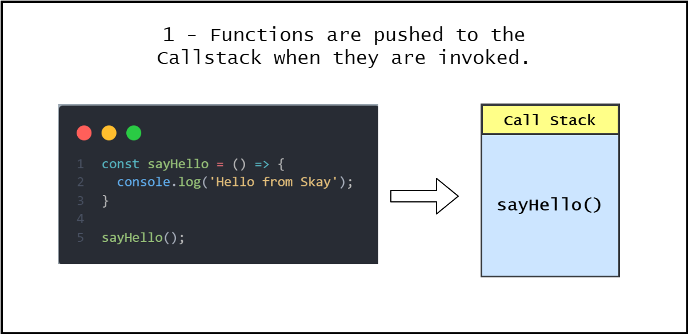
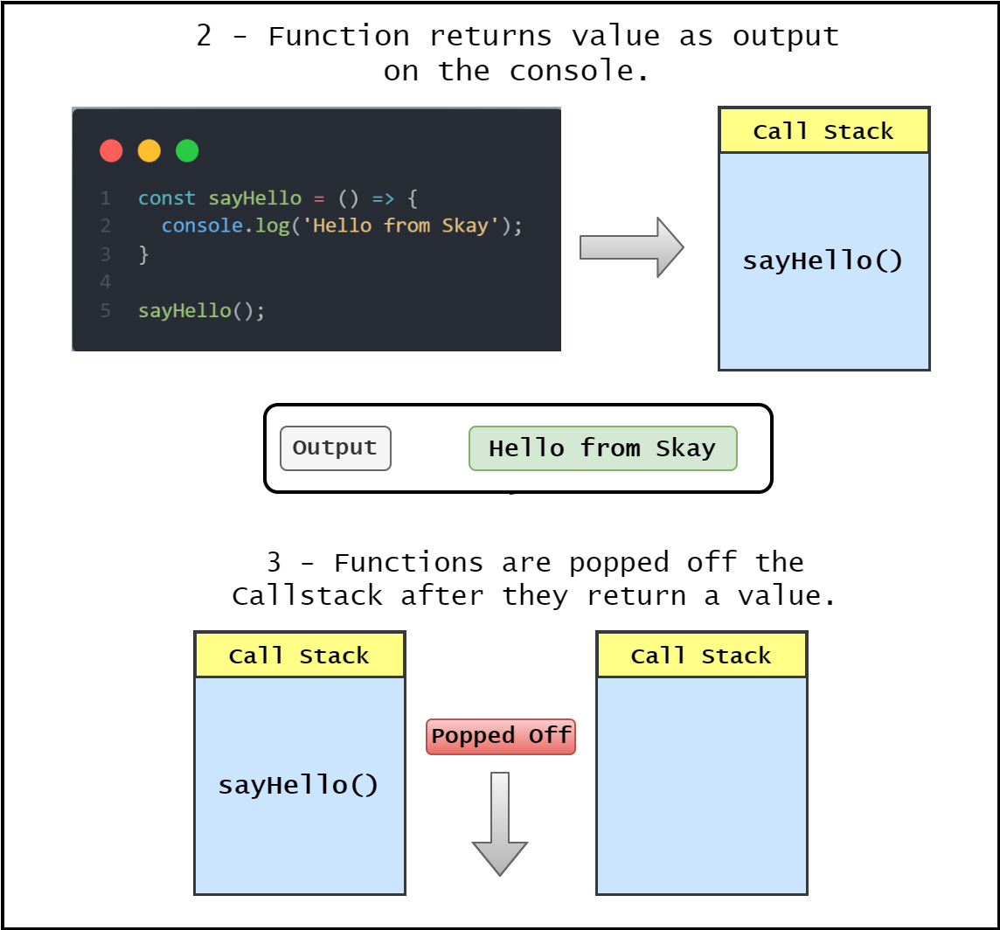
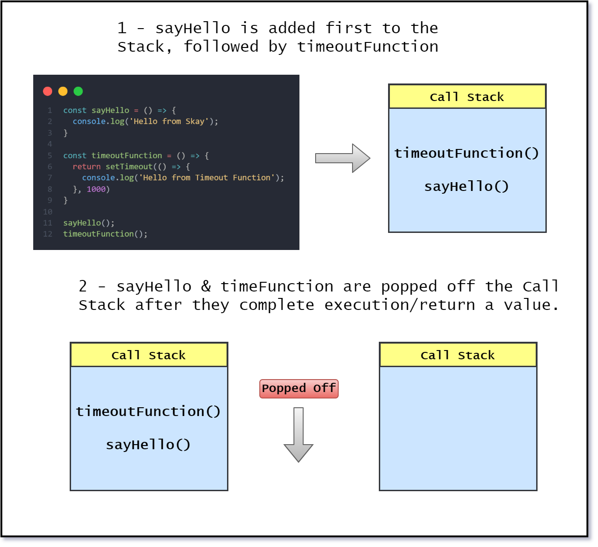
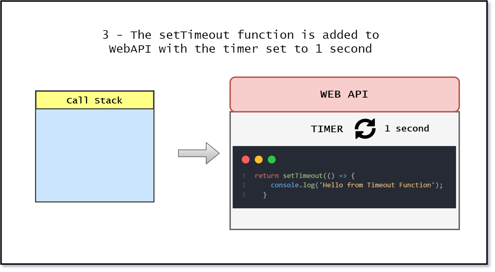
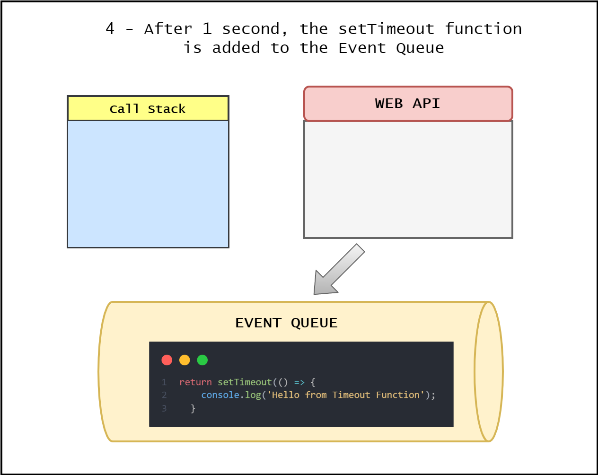
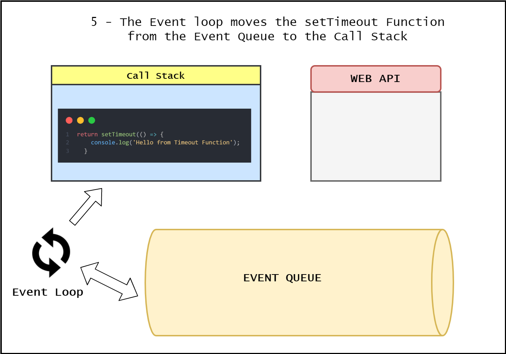
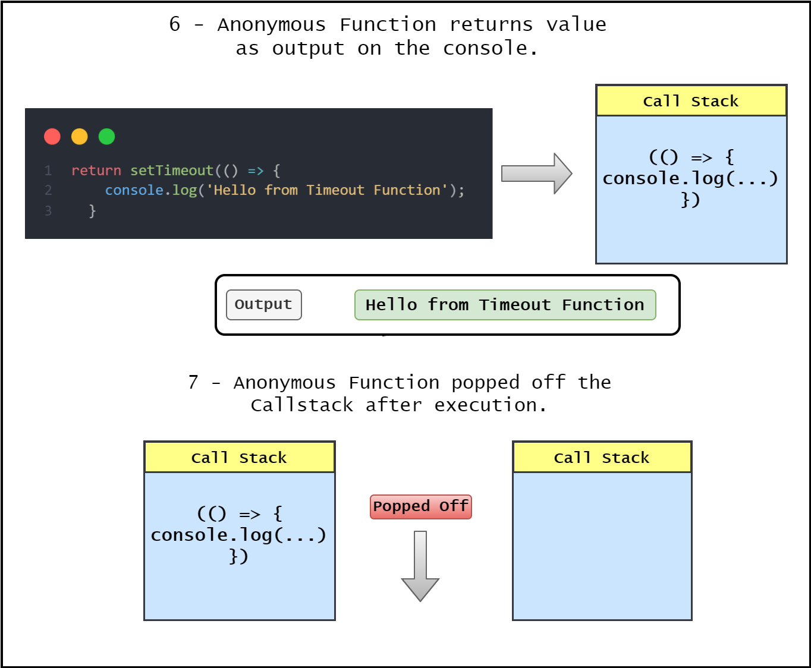

# Introduction

JavaScript Event Loop is one of the most fundamental concepts that every developer must aspire to understand. It is also one of the most frequently asked interview questions.

JavaScript essentially is Single-threaded, i.e., it can only execute one task at a time. So, what happens if one request takes more than 2 minutes to execute? Will the user be kept waiting for ever? It certainly not an ideal situation. Thankfully, JavaScript’s Event loop architecture comes to the rescue, as it provides the ability to process multiple requests asynchronously.

We will first look at the following components that constitute Event Loop Architecture.

The Call Stack

Web API

Event Queue

Once we try and understand how they work together, then explaining Event Loop becomes very simple.

## Call Stack

The Call Stack is a part of the JavaScript Engine and it is simply a stack in which you can add an item and the item added first is processed last. In other words, it follows the FILO - ‘First In Last Out’ principle.

A Call Stack acts as a placeholder or a holding area for all the JavaScript functions that have been fired for execution.

Let us look at the below code sample and understand how the function ‘sayHello’ gets added to the Call Stack.

```javascript
const sayHello = () => {
  console.log('Hello from Skay');
};

sayHello();
```

## Step 1 - sayHello Function gets added to the Call Stack

From the illustration below, you can see once the function sayHello() is invoked, it is added to the call stack.



## Step 2 & 3 - Function returns a value & gets popped from the Call Stack

Once the function returns a value, the output ‘Hello from Skay’ gets displayed on the console. As soon as the function returns, almost immediately, the function is also popped off from the call stack.



Now, let’s look at the below code example, with two functions and understand how the JavaScript Engine executes it.

```javascript
const sayHello = () => {
  console.log('Hello from Skay');
};

const timeoutFunction = () => {
  return setTimeout(() => {
    console.log('Hello from Timeout Function');
  }, 1000);
};

sayHello();
timeoutFunction();
```

As discussed previously, the two functions are added to the Call Stack as shown below. And the function sayHello() is popped off the stack once the function execution completes.



However, as for the second function ‘timeoutFunction’, it returns a setTimeout function which is a part of the Web API. Let us look at what Web API is first.

## Web API

Web APIs are built into your web browser and they are able to process data from the browser to do complex useful things. The main thing to understand is that, they are not a part of the JavaScript language, but, they are built on top of the core JS language and provide much more capabilities such as Geolocation, localstorage, etc.

So, coming back to our code example, when the function ‘timeoutFunction’ is executed, it returns the ‘setTimeout’ function and is popped off the stack.

Since the ‘setTimeout’ function is part of the Web API, it gets moved to the Web API as shown below. Along with that, the timer function in Web API is set to 1 second (1000 ms) based on the argument we had passed to the ‘setTimeout’ function as shown in the illustration below.



So, what happens after one second? Ideally, you would have anticipated that the function is returned back to the Call Stack for execution. However, instead, it adds it to the Event Queue.

## Event Queue

Event Queue is a data structure similar to Stack, which holds the data temporarily and the important thing to note is that the data added first is processed first. In other words, it follows the FIFO -> ‘First in First out’ principle.

So after one second, the ‘setTimeout’ function from Web API is added to the Queue as shown below.



## Event Loop

Finally, the ‘Event Loop’ we’ve been waiting for. The function of Event Loop can simply be explained as connecting the Event Queue to the Call Stack.



Event Loop does the following:

Checks if the Call Stack is empty, i.e., if all the functions have completed their execution and they have been popped off the Call Stack.

Once the Call Stack is empty, it moves the first item from the Event Queue to the Call Stack.

When the setTimeout function gets added to the Call Stack, the function simply returns the output ‘Hello from Timeout Function’ on the console and is popped out of the Stack.



That’s all there is to know about Event Loop. Hope the explanation with illustrations provided a way to understand Event Loop in a simple manner.

In fact, there’s a tool to visualize the Even Loop in real time built by [Philip Roberts](https://twitter.com/philip_roberts), which you can access from this [link](http://latentflip.com/loupe/?code=JC5vbignYnV0dG9uJywgJ2NsaWNrJywgZnVuY3Rpb24gb25DbGljaygpIHsKICAgIHNldFRpbWVvdXQoZnVuY3Rpb24gdGltZXIoKSB7CiAgICAgICAgY29uc29sZS5sb2coJ1lvdSBjbGlja2VkIHRoZSBidXR0b24hJyk7ICAgIAogICAgfSwgMjAwMCk7Cn0pOwoKY29uc29sZS5sb2coIkhpISIpOwoKc2V0VGltZW91dChmdW5jdGlvbiB0aW1lb3V0KCkgewogICAgY29uc29sZS5sb2coIkNsaWNrIHRoZSBidXR0b24hIik7Cn0sIDUwMDApOwoKY29uc29sZS5sb2coIldlbGNvbWUgdG8gbG91cGUuIik7!!!PGJ1dHRvbj5DbGljayBtZSE8L2J1dHRvbj4%3D).

# Conclusion

To summarize, in this article, we learnt about how JavaScript is Single-Threaded in nature and using Event Loop, it supports processing multiple-requests with the help of a Call Stack, Web API and Event Queue.

Event Loop is basically the way where JavaScript engine looks at the queue to find out if there are any immediate functions to run and picks the one added first and moves it to the Call Stack.

We demonstrated the above concept using the asynchronous setTimeout function which is a part of the Web API.

Fin!
